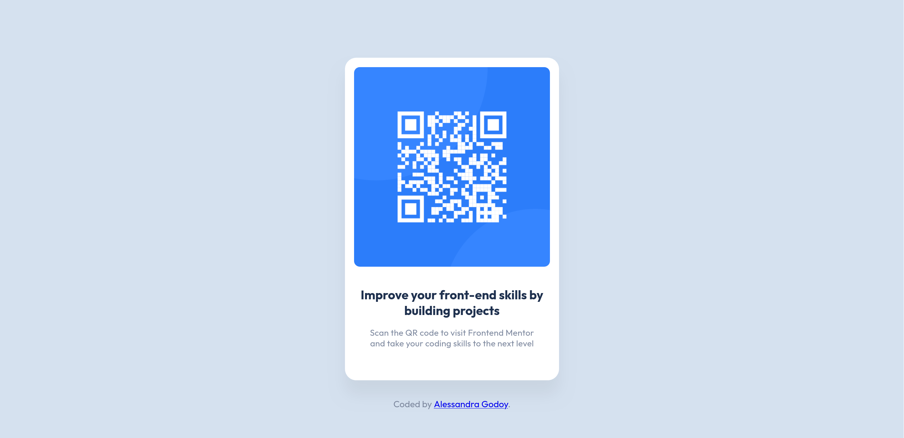

# QR Code Component

## Table of contents

- [Overview](#overview)
  - [Screenshot](#screenshot)
- [My process](#my-process)
  - [Built with](#built-with)
  - [What I learned](#what-i-learned)


## Overview

### Screenshot
<figure>
  
  <figcaption>Fig.1 - Desktop Version</figcaption>
</figure>
<figure>
  
  <figcaption>Fig.2 - Mobile Version</figcaption>
</figure>

## My process

The QR Code Component project focuses on creating a responsive, visually appealing QR code component. The goal was to implement a clean and simple design that adapts seamlessly across different devices, utilizing modern CSS techniques to ensure optimal performance and aesthetics. 


### Built with

- Semantic HTML5 markup
- CSS custom properties
- Flexbox

### What I learned
I learned to effectively use CSS custom properties (variables) to manage design attributes more efficiently. Declaring variables in the `:root` selector allows for consistent styling across the entire project and simplifies future updates.

Here is an example of how variables are declared in the `:root` selector:

```css
:root {
    --clr-neutral-100: rgba(255, 255, 255, 1);
    --clr-neutral-300: rgba(213, 225, 239, 1);

    --clr-font-dark: rgba(31, 49, 79, 1);
    --clr-font-light: rgba(125, 136, 158, 1);

    --ff-sans: "Outfit";

    --fs-400: 0.9375rem;
    --fs-700: 1.375rem;

    --fw-normal: 400;
    --fw-bold: 700;
}
```
Thank you for checking out my QR Code Component solution. I hope you find it helpful and insightful. If you have any questions or feedback, please feel free to reach out! 🌠
This is a solution to the [QR code component challenge on Frontend Mentor](https://www.frontendmentor.io/challenges/qr-code-component-iux_sIO_H).
